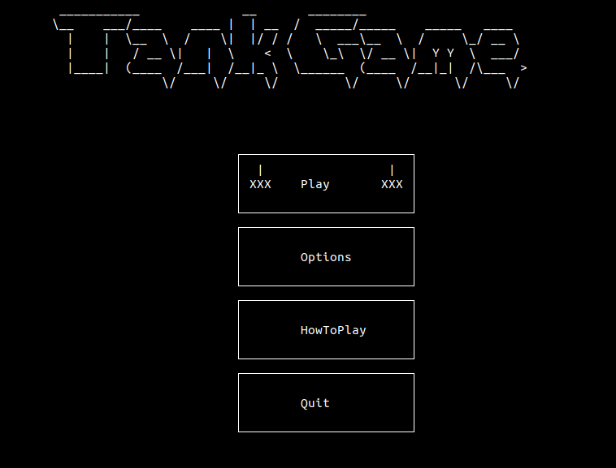
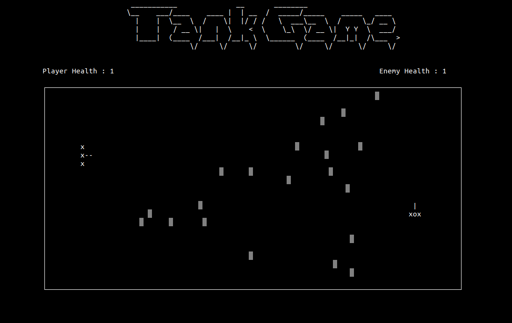

# Tank game using c++ and ncurses

## About Tank 1990

Tank 1990 is a multi-directional shooter video game for the Family Computer produced and published in 1985 by Namco. It is a successor to Namco's 1980 Tank Battalion, and would be succeeded itself by the 1991 Tank Force.

An arcade version for the Nintendo VS. System would follow, and the game would eventually end up with the Virtual Console release for the Wii and Wii U. There was also a related Game Boy game of the same name dating back to 1991, which was developed and published by Nova Games.

## Screenshots




## What you need

You must use linux system

Install ncurses make and cmake
```
sudo apt-get install libncurses5-dev
sudo apt-get install make
sudo apt-get install cmake
```
## How to run
```
cd build

cmake ..
make

./Tank_Game
```
## Gameplay

The player controls a tank and shoot bullets to destroy enemy tank around the playfield. 
Both tanks have 1 health point. Game ends when someone destroyes.


## How To Play

"W"  -   Up
  
"S"  -   Down
  
"A"  -   Left

"D"  -   Right
  
"J"  -   Shot
  
"Q"  -   Quit

